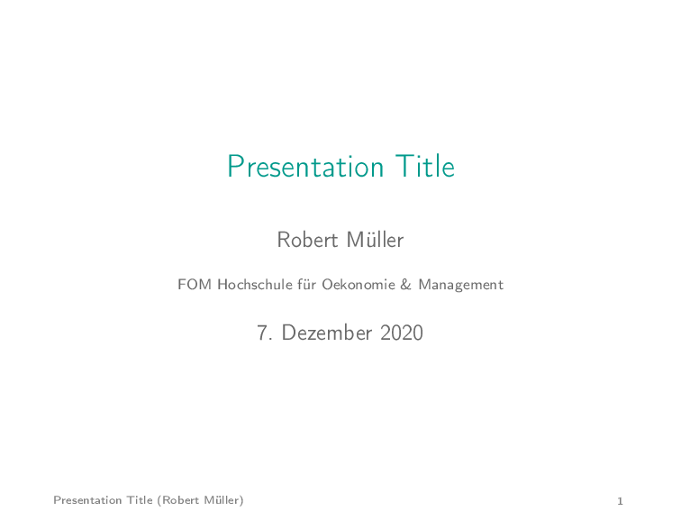
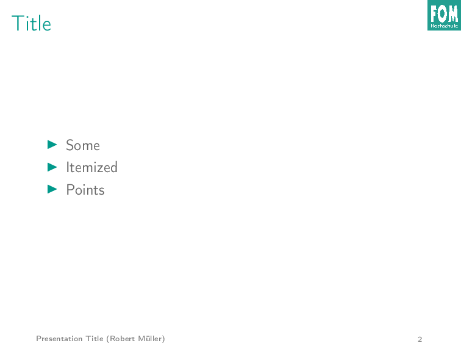
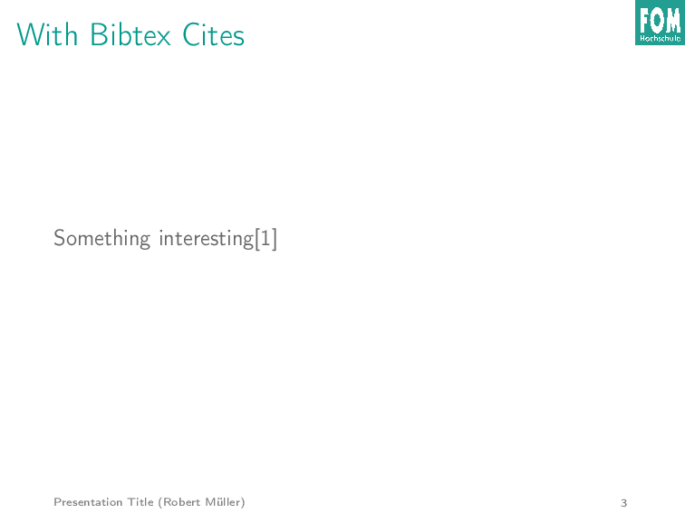
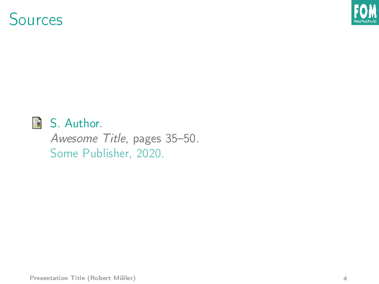

# FOM Presentation Latex Template

Template for a simple beamer presentation styled with the FOM colors and its logo. Including support for bibtex

## Usage

Your need to compile the presentation multiple times in order to get correct bibtex cites and page numbers.

```
pdflatex main.tex
bibtex main
pdflatex main.tex
pdflatex main.tex
```

## Example Presentation




